<h1>Understanding CNN & Image Classification of Flowers</h1>

<h4>Studied Stanford's lecture on CNN's</h4>

[]

Keywords: Convolutional neural networks, perceptron, neocognitron, LeNet, AlexNet, convolution, pooling, fully-connected layers

Slides: http://cs231n.stanford.edu/slides/2017/cs231n_2017_lecture5.pdf

<h3>Image Classification of Flowers using CNN's</h3>
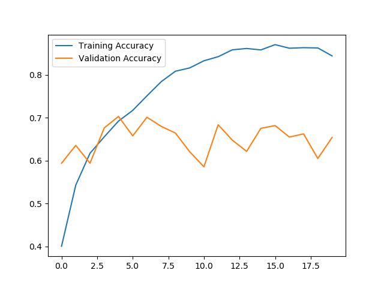

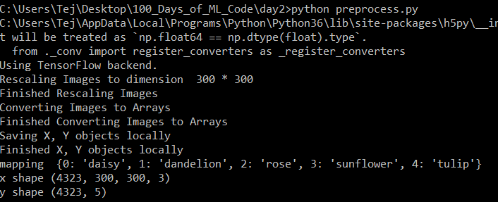

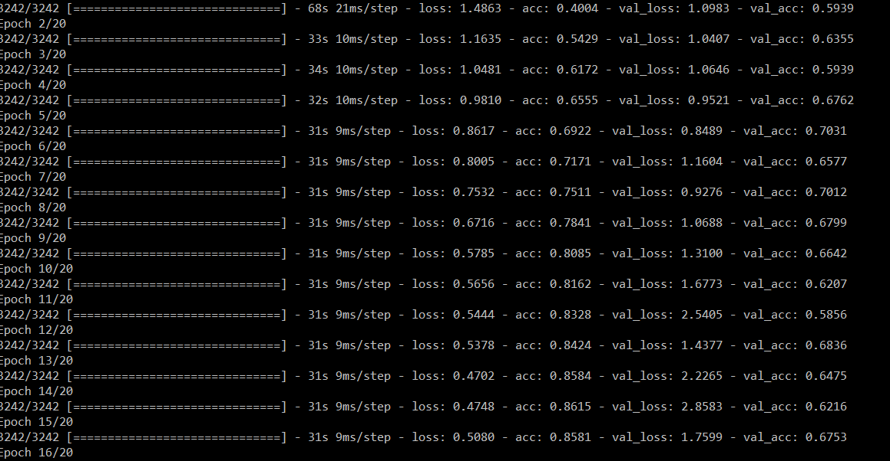

<ol>
	<li>
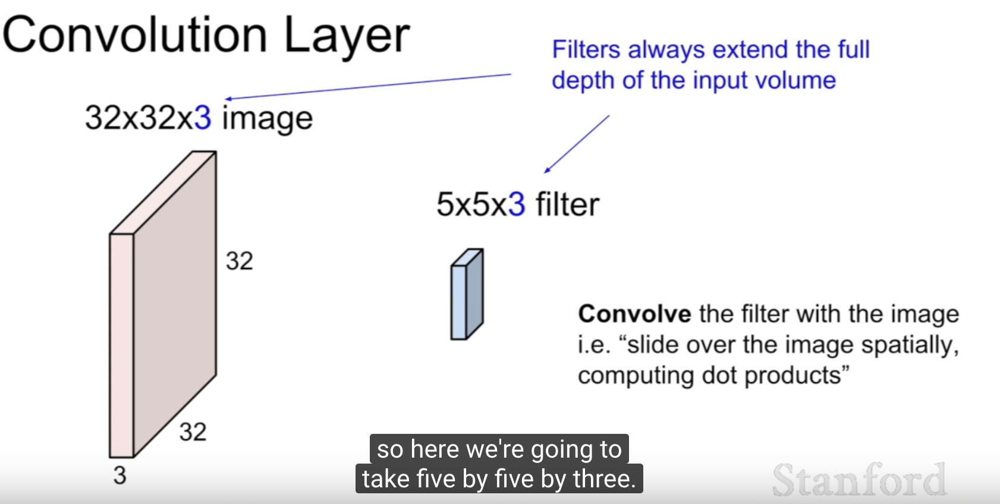
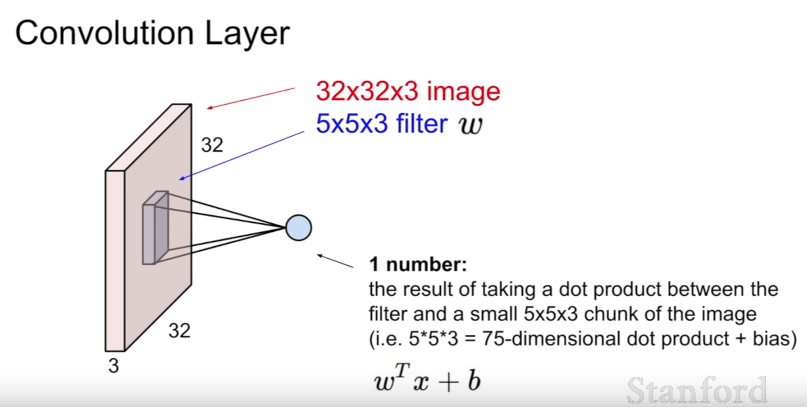
	</li>

<li>
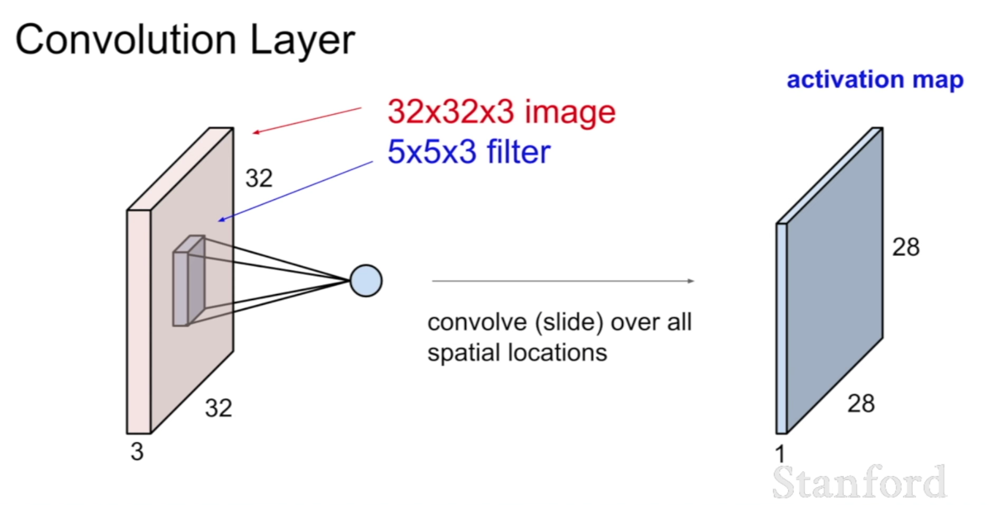
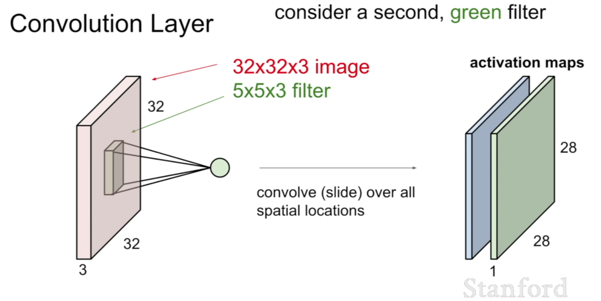
</li>

<li>
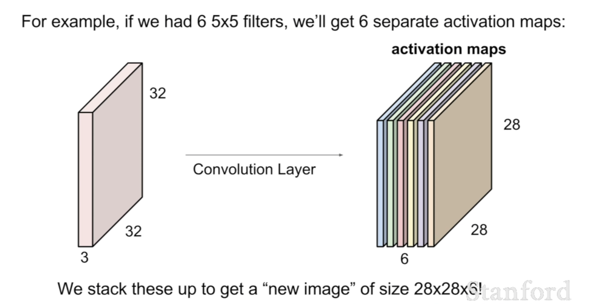
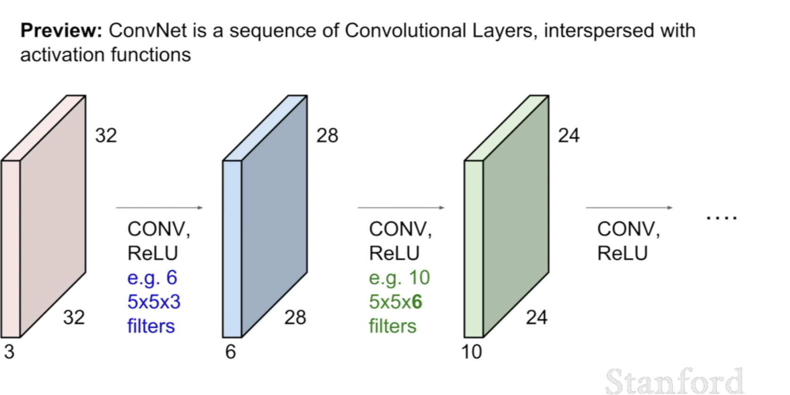
</li>

<li>
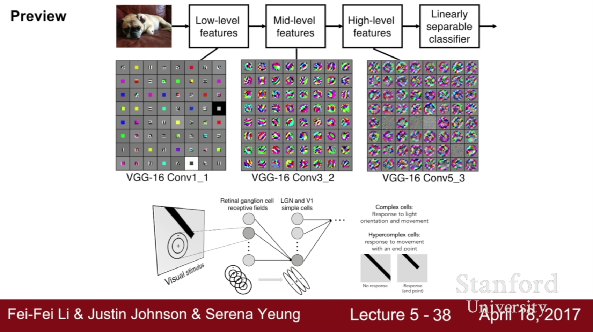
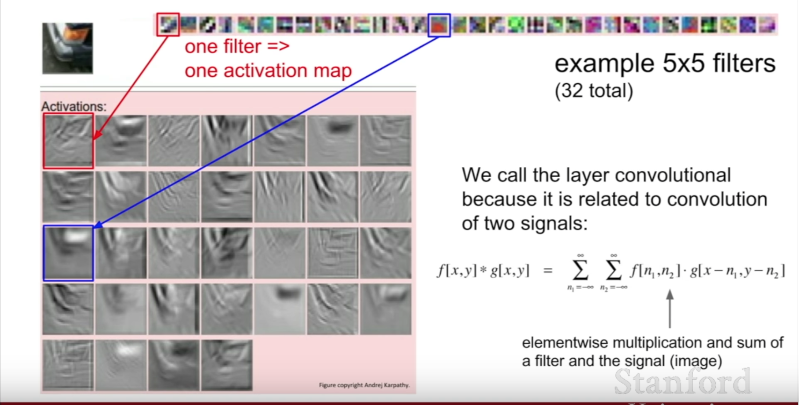

</li>

<li>
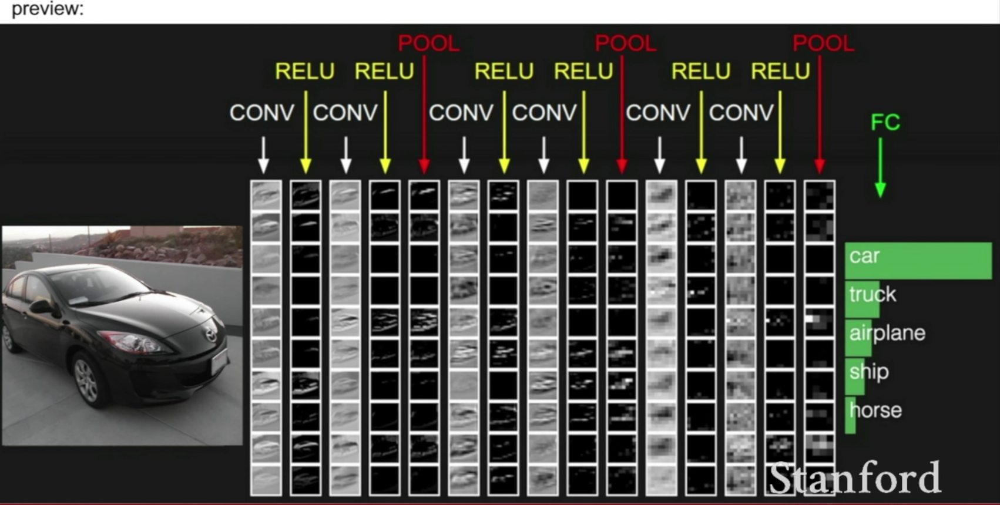
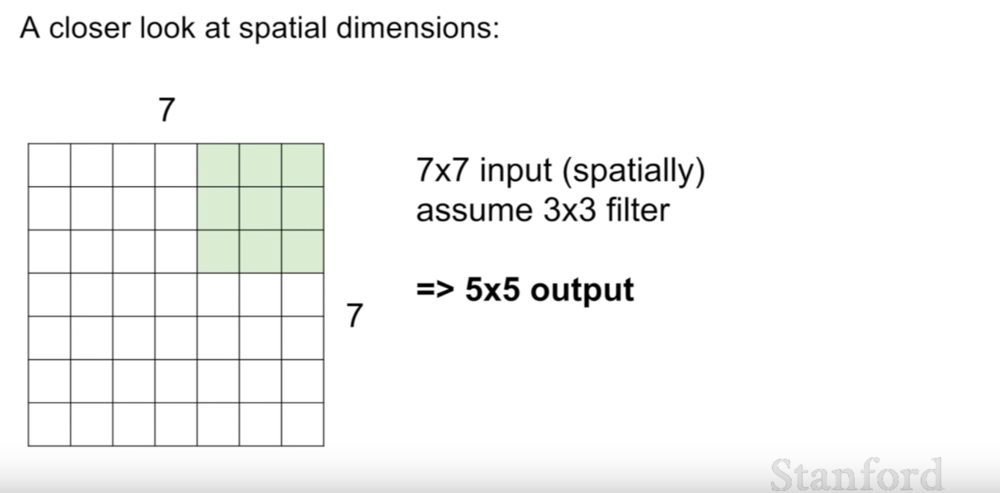
</li>

<li>
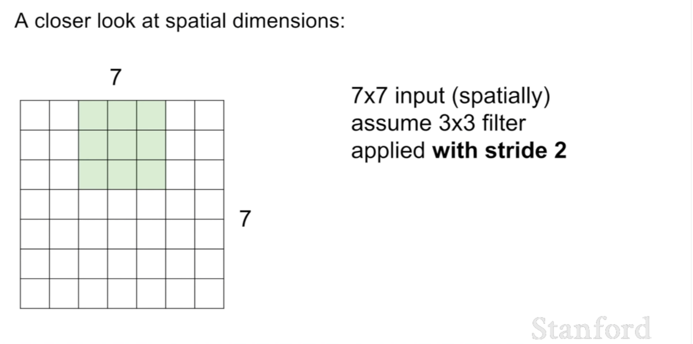
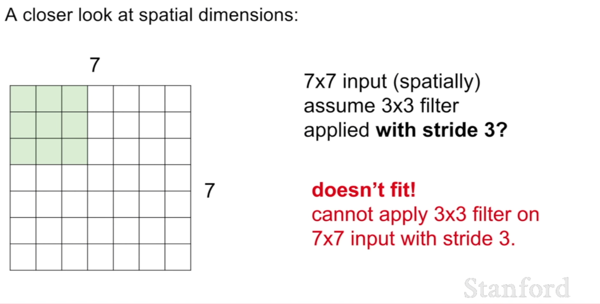

</li>

<li>
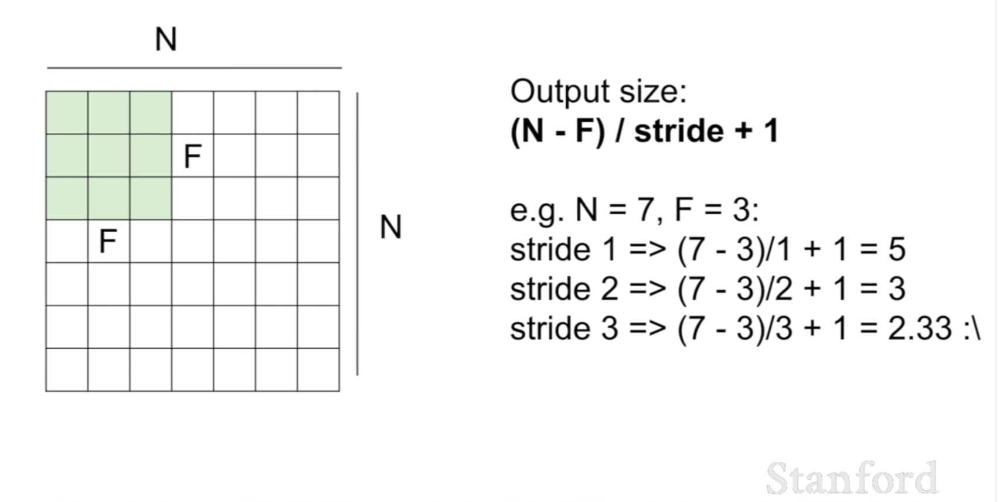

</li>

<li>
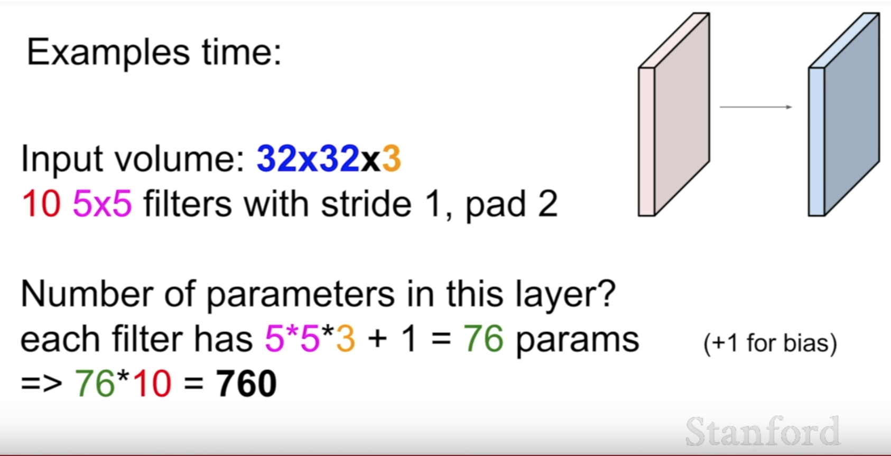
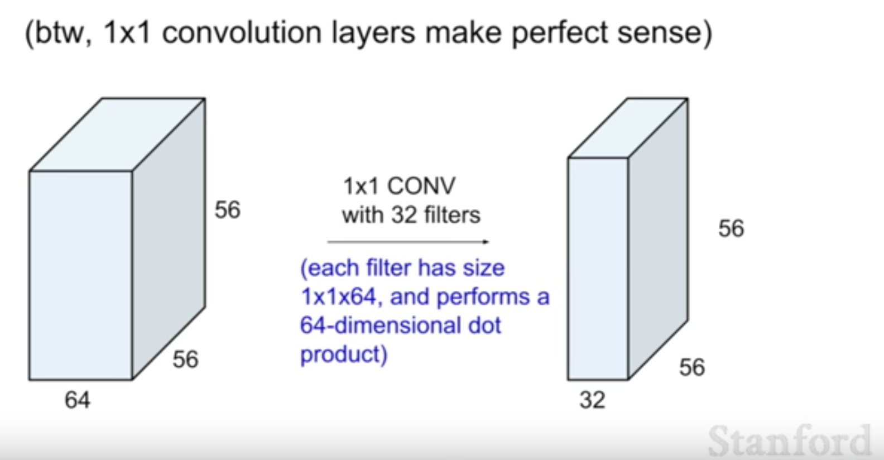

</li>

<li>

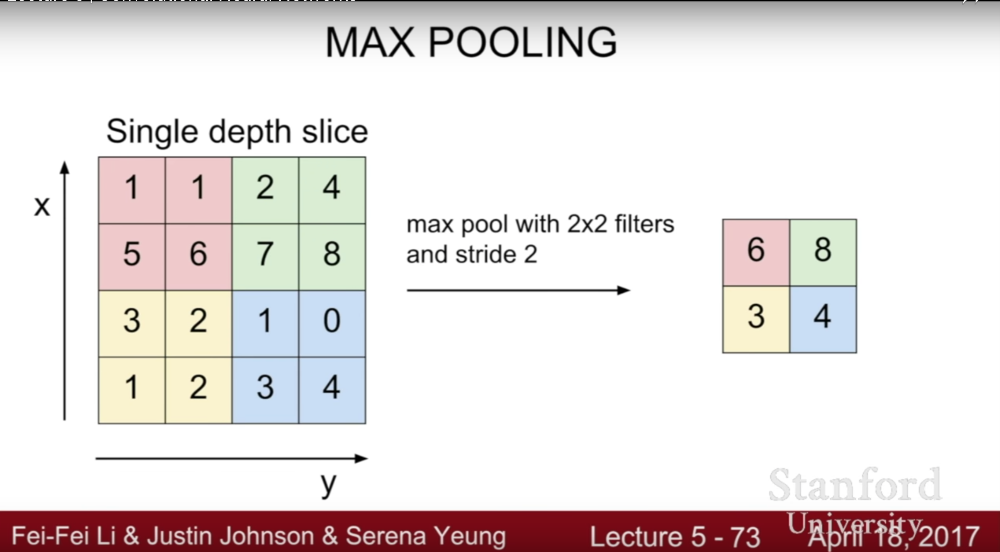

</li>

</ol>
