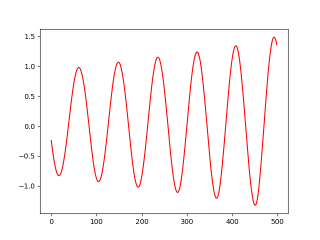
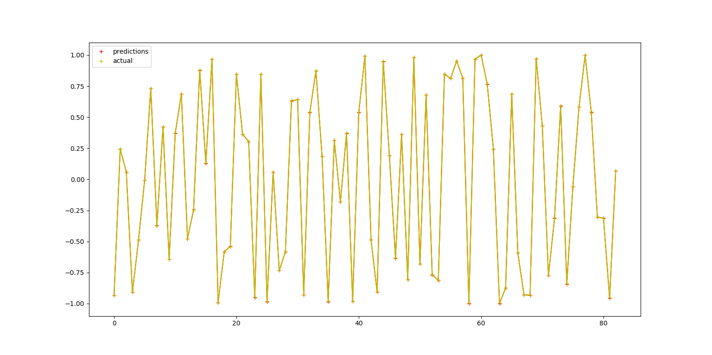

<h1>Understanding RNNS & Time Series Based value (Sine Function) Regression using BiDirectional LSTM RNN</h1>

dataset shape  (5000, 1)
X shape  (1665, 3, 1)
Y shape  (1665, 1)

| Layer(type)       	        | Output Shape           |  Param #  |
| ------------- 		|:-------------:	 | -----:    |
| bidirectional_1 (Bidirectional LSTM)  |  (None, 80)  |   13440     |
| dense_1 (Dense)   	        |  (None, 1)  		 |    81    |
| activation_5 (Activation)     |  (None, 1)  		 |    0      |

Total params: <b>13,521</b>
Trainable params: 13,521
Non-trainable params: 0
Train on 1248 samples, validate on 417 samples

_________________________________________________________________

