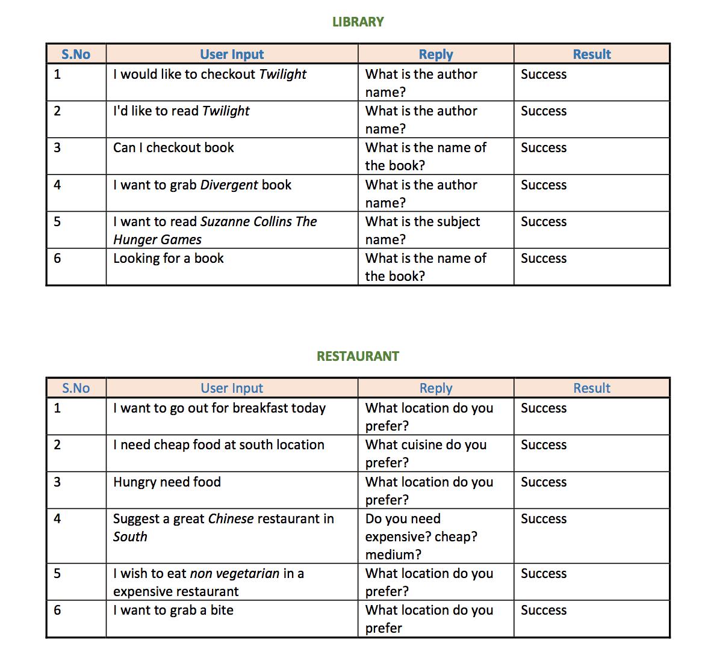

Simple Chatbot from library management and Restraunt Finding 
built from scratch using Python.

<h2>How To execute</h2>
 
 Install dependencies
 
 Execute Chatbot.py

<h2>How it works</h2>

Chatbot is built by taking below items as core components

Intents (List of possible phrases Ex: Can you order me something)

Entities (Objects/Actors Ex: Restraunt Names,..etc)

Actions (Some action on Database Ex: Booking Restraunt)

--------------------------------------------------------
<h2>Dataset Info</h2>

Dataset Used: CSV files

Library (booklibrary.csv)

Restaurant (Restaurantlist.csv)

--------------------------------------------------------

Number of intents
Library (200+ ) Restaurant (150+)

Both DBs have more than 100 entries each.

Number of entities are more than 3 for each problem.

<h2>Problem Domain: Library</h2>
--------------------------------------------------------

	The system takes the Name, Author, Subject (Genre) of the book and Registration number as inputs from the user (like userid).
	If a book matching the details entered exists in the database, the system returns a
	message "FetchBook task is completed" along with the book details and Invoice number. 
	
	It returns a message indicating that the book not found if the details given by the user does not match any record in the database.

	The user need to provide the exact Name, Author Name and Genre of the book. Registration number can be any integer value.

--------------------------------------------------------

<h2>Problem Domain: Restaurant</h2>
--------------------------------------------------------
	
	The system takes the Location (North,South,East,West), Cuisine(Chinese….etc), 
	
	CostType(Cheap,Medium, Expensive,….etc) and suggests the restaurants names to user. 
	
	It shows multiple restraints if it has multiple matches

--------------------------------------------------------

Additional Info:

	Regular expressions  used to correct typos.

