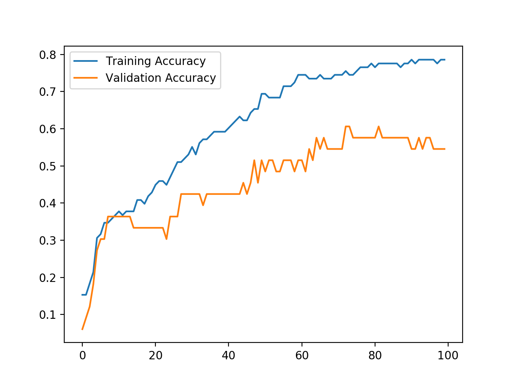
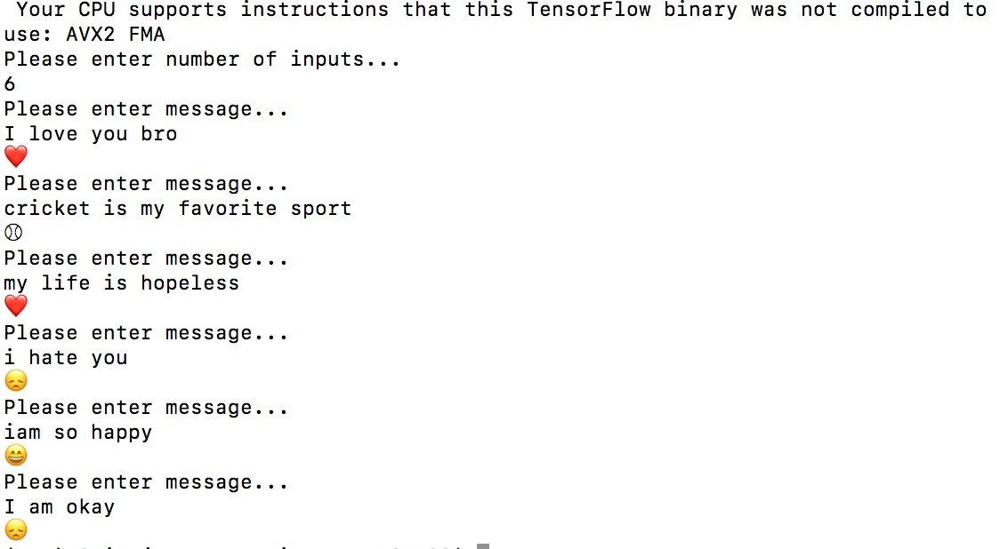

word_to_index : {'word' : 1}

index_to_word : {1 : 'word'}

embedding matrix : (400001, 50 )

[
[0,0,0,......0],
[],
[],
]
sentences_indices (number_of_records, maxLength)

[

	[32, 1, 12, 2, 3, 8, 9, 0, 0 , 0 , 0, 0],

]

<h1>Understanding RNNS & Text Sentimental Classification as Emoji's Using Pre-Trained Word Embeddings and Dense Vanila Softmax NN

</h1>

X shape  (98, 50)
Y shape  (98, 5)

| Layer(type)       	        | Output Shape           |  Param #  |
| ------------- 				|	:-------------:		 | -----:    |
| dense_1 (Dense)   	        |  (None, 5)  		 	 |    255    |

Total params: <b>255</b>
Trainable params: 255
Non-trainable params: 0

_________________________________________________________________

